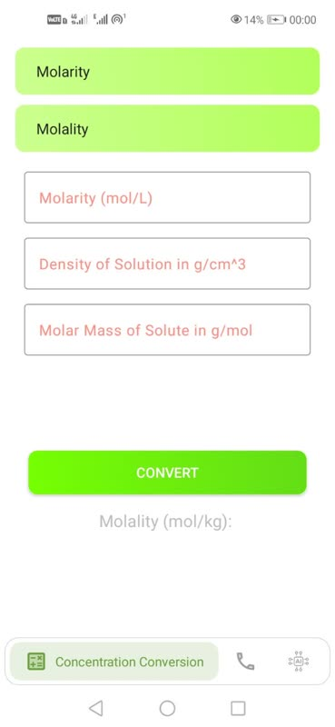
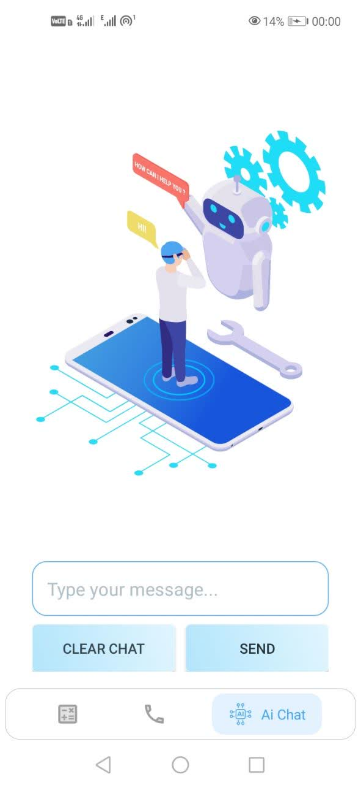

# 🏆 Solitpy: The Smart Chemistry & AI Assistant

*اپلیکیشن تخصصی محاسبات محلول‌های شیمیایی و دستیار هوشمند مبتنی بر AI*

   

---

## 🌟 Overview | معرفی اپلیکیشن

**English:**
**Solitpy** is a high-performance Android utility that bridges the gap between scientific calculations and artificial intelligence. It features a robust Chemistry Concentration Converter and a GPT-3.5 powered ChatBot with a built-in monetization system via Café Bazaar.

**فارسی:**
**Solitpy** یک اپلیکیشن کاربردی و قدرتمند اندرویدی است که محاسبات علمی شیمی را با هوش مصنوعی ترکیب کرده است. این برنامه شامل یک مبدل پیشرفته غلظت محلول‌ها و یک چت‌بات هوشمند (GPT-3.5) است که سیستم پرداخت درون‌برنامه‌ای کافه‌بازار (Poolakey) را برای مدیریت اشتراک‌ها و محدودیت‌ها در خود جای داده است.

---

## 🎬 App Demo | نمایش ویدئویی برنامه

<div align="center">
  <video src="gif.mp4" width="300" controls autoplay loop muted></video>
  <p><i>نمایش محیط اپلیکیشن و سرعت پاسخ‌دهی هوش مصنوعی</i></p>
</div>

---

## 🎯 Features | ویژگی‌های کلیدی

| Feature | Description (EN) | توضیح فارسی |
| :--- | :--- | :--- |
| 🧪 **Advanced Chemistry** | Convert between Molarity, Molality, ppm, ppb, and more with high precision | تبدیل دقیق واحد‌های غلظت مانند مولاریته، مولالیته، ppm و... |
| 🤖 **AI Chat Assistant** | Integrated GPT-3.5 Turbo for answering scientific and general questions | چت‌بات هوشمند اختصاصی برای پاسخ به سوالات علمی و عمومی |
| 💳 **Bazaar Payment** | Secure in-app purchase system using Poolakey for AI credit recharge | سیستم پرداخت امن درون‌برنامه‌ای (پلکی) برای شارژ شانس چت |
| 📊 **Real-time Analytics** | Firebase integration for tracking crashes and performance metrics | مانیتورینگ هوشمند کرش‌ها و عملکرد برنامه با فایربیس |
| 🎨 **Modern UI** | Sleek navigation using ChipNavigationBar and Lottie animations | رابط کاربری مدرن با نویگیشن اختصاصی و انیمیشن‌های لاتی |
| 🔢 **Smart Input** | Custom decimal filters for Persian/English number support | فیلتر هوشمند ورودی برای پشتیبانی از اعداد فارسی و اعشاری |

---

## 📲 Screenshots | تصاویر برنامه

<div align="center">
  <table>
    <tr>
      <td align="center">
        <br />
        <b>Home/Conversion</b>
      </td>
      <td align="center">
        <br />
        <b>AI Chat UI</b>
      </td>
      <td align="center">
        <br />
        <b>Support & Contact</b>
      </td>
    </tr>
  </table>
</div>

---

## 🛠️ Technologies | تکنولوژی‌های به کار رفته

* **Architecture:** مدیریت پیشرفته Fragment‌ها و نویگیشن بار مدرن.
* **Networking:** بهره‌گیری از **Retrofit 2 & OkHttp** برای فراخوانی API.
* **AI Engine:** قدرت گرفته از مدل **GPT-3.5 Turbo** (از طریق AvalAI API).
* **Monetization:** پیاده‌سازی **Poolakey SDK** جهت اتصال به درگاه پرداخت کافه‌بازار.
* **Firebase Suite:** شامل Analytics، Crashlytics و Performance Monitoring.

---

## ⚙️ How to Use | نحوه استفاده

1. **بخش محاسبات:** واحد ورودی و خروجی را انتخاب کنید تا فیلدها ظاهر شوند.
2. **هوش مصنوعی:** در بخش AI می‌توانید سوالات خود را بپرسید (۵ شانس اول رایگان).
3. **شارژ اعتبار:** از طریق درگاه مستقیم کافه‌بازار اعتبار چت تهیه کنید.

---

## 📦 Installation | نصب

```bash
git clone [https://github.com/mr-coder20/solitpy.git](https://github.com/mr-coder20/solitpy.git)
